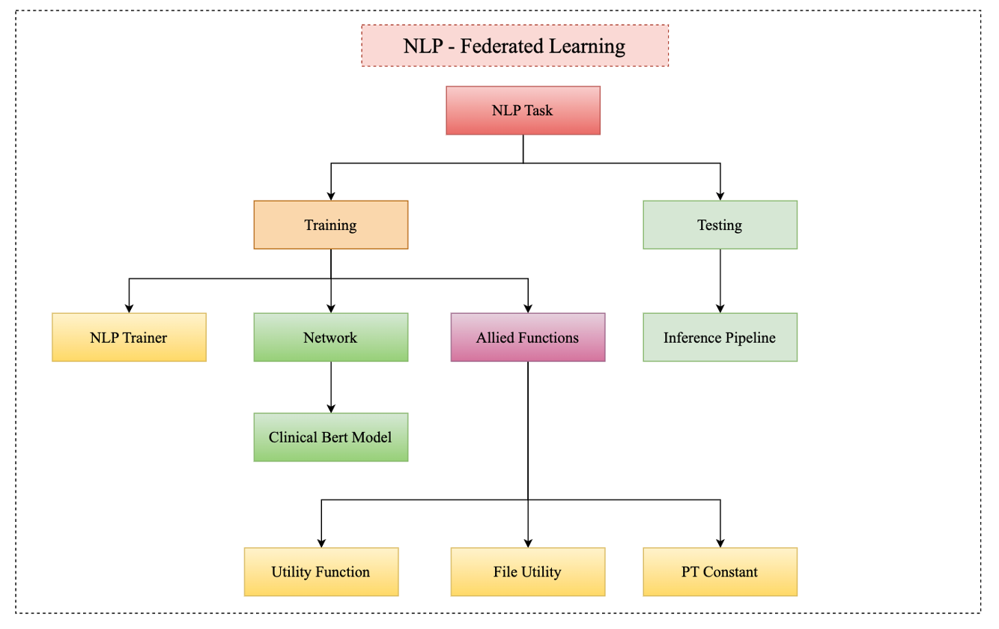
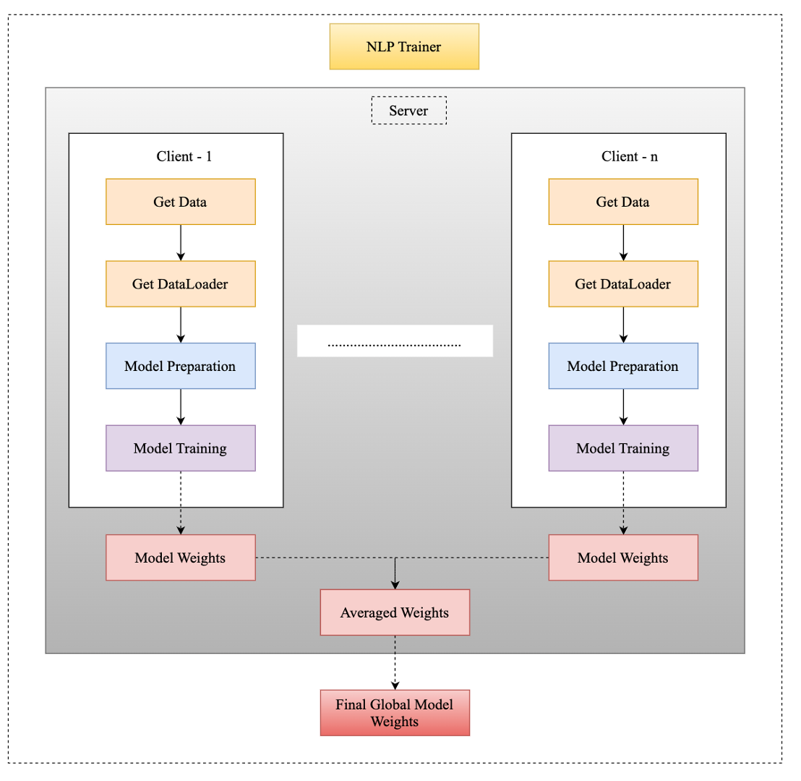
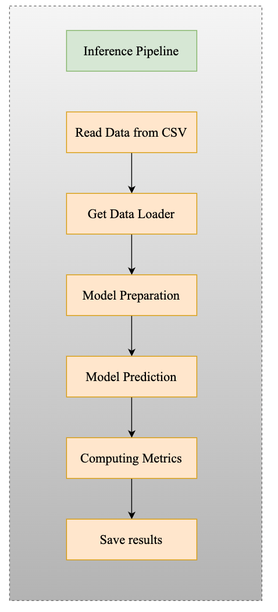

# Federated Training -- NLP Task

- This repository holds the scripts for training a federated training pipeline for a NLP Task of patient readmission based on the clinical text dataset.

# Datasets

- We use MIMIC-III dataset. We assume that anyone using this repository has a license to access the MIMIC-III dataset. If not, license can be obtained by applying at www.physionet.org
- Dataset needs to be loaded into the Rhino Health (RH) dashboard using the client VM.

This are the following steps required for the 
- Relevant schema for the loading the dataset needs to uploaded on the RH dashboard
- Upload the dataset to the client VM using the upload option in the ssh terminal
- Move the folder to the

# Model

- [Clinical Bert Model](#https://arxiv.org/pdf/1912.11975.pdf)

# Requirements

- Tested on a GCP n1-highmem-8 CPU VM instance built from the deep learning pytorch-latest-cpu-20210414 image

# Installation

- Start the GCP instance and login as jupyter user with ```gcloud compute ssh jupyter@user-name --project rosenthallab-rhino -- -L 8080:localhost:8080```
- Clone this GCP source repo, nlp_task,  to the required folder structure (```/home/jupyter/```)

# Docker Usage

- Step 1: ```cd nlp_task/nlp_task```
- Step 2: ```../gc-docker-utils/docker-push.sh rhino-gc-workgroup-dfci <docker image name>```

- Output :
```bash
jupyter2@nalawade-dxvm:/home/jupyter/Projects/fed_learn/federated_training/rhino_health/nlp/dashboard/nlp_task$ ../gc-docker-utils/docker-push.sh rhino-gc-workgroup-dfci fl_nlp51
+ DOCKER_BUILDKIT=1
+ docker buildx build --push --platform linux/amd64 -t 913123821419.dkr.ecr.us-east-1.amazonaws.com/rhino-gc-workgroup-dfci:fl_nlp51 .
[+] Building 189.9s (16/16) FINISHED                                                                                                                                                       
 => [internal] load build definition from Dockerfile                                                                                                                                  0.0s
 => => transferring dockerfile: 32B                                                                                                                                                   0.0s
 => [internal] load .dockerignore                                                                                                                                                     0.0s
 => => transferring context: 2B                                                                                                                                                       0.0s
 => [internal] load metadata for docker.io/nvidia/cuda:11.3.1-cudnn8-runtime-ubuntu20.04                                                                                              0.3s
 => [internal] load build context                                                                                                                                                     0.0s
 => => transferring context: 1.59kB                                                                                                                                                   0.0s
 => [stage-0  1/10] FROM docker.io/nvidia/cuda:11.3.1-cudnn8-runtime-ubuntu20.04@sha256:a3a934951f9cb707732b29430856cd77ca33fe2560e41722741edc8983102d79                              0.0s
 => CACHED [stage-0  2/10] RUN --mount=type=cache,id=apt,target=/var/cache/apt     rm -f /etc/apt/apt.conf.d/docker-clean  && apt-get update  && apt-get install -y -q software-prop  0.0s
 => CACHED [stage-0  3/10] RUN ( getent group 5642 >/dev/null || groupadd -r -g 5642 localgroup )  && useradd -m -l -s /bin/bash -g 5642 -N -u 5642 localuser                         0.0s
 => CACHED [stage-0  4/10] RUN mkdir /venv  && chmod g+s /venv  && chown 5642:5642 /venv  && python3.8 -m venv /venv                                                                  0.0s
 => CACHED [stage-0  5/10] COPY requirements.txt ./                                                                                                                                   0.0s
 => CACHED [stage-0  6/10] RUN --mount=type=cache,target=/root/.cache/pip     python -m pip install --upgrade pip setuptools wheel  && pip install -r requirements.txt  && rm requir  0.0s
 => CACHED [stage-0  7/10] WORKDIR /home/localuser                                                                                                                                    0.0s
 => CACHED [stage-0  8/10] COPY --chown=5642:5642 ./custom ./custom                                                                                                                   0.0s
 => CACHED [stage-0  9/10] COPY --chown=5642:5642 ./infer.py ./infer.py                                                                                                               0.0s
 => CACHED [stage-0 10/10] COPY --chown=5642:5642 ./config ./config                                                                                                                   0.0s
 => exporting to image                                                                                                                                                                0.0s
 => => exporting layers                                                                                                                                                               0.0s
 => => writing image sha256:b3924ec652ec6d2eed2a563b18d71fd3dce167dc41b32b76ec9bfd34bc32fdca                                                                                          0.0s
 => => naming to 913123821419.dkr.ecr.us-east-1.amazonaws.com/rhino-gc-workgroup-dfci:fl_nlp51                                                                                        0.0s
 => pushing 913123821419.dkr.ecr.us-east-1.amazonaws.com/rhino-gc-workgroup-dfci:fl_nlp51 with docker                                                                               188.6s
 => => pushing layer aef1430aed3d                                                                                                                                                     1.3s
 => => pushing layer d37fc39c3895                                                                                                                                                     1.3s
 => => pushing layer ff9a7bd09ae4                                                                                                                                                   139.9s
 => => pushing layer 5f70bf18a086                                                                                                                                                   188.7s
 => => pushing layer 1455c5055a0c                                                                                                                                                   425.0s
 => => pushing layer 11c53154e8d3                                                                                                                                                   188.9s
 => => pushing layer 9f5efd3bbbc9                                                                                                                                                     3.1s
 => => pushing layer a6de0e5313b0                                                                                                                                                     2.3s
 => => pushing layer a94813458544                                                                                                                                                    15.1s
 => => pushing layer d4b30b316333                                                                                                                                                   188.9s
 => => pushing layer ad8fec0b36f1                                                                                                                                                   188.9s
 => => pushing layer 3a217af3edf9                                                                                                                                                   188.9s
 => => pushing layer 3297f5de02be                                                                                                                                                   188.7s
 => => pushing layer f3717d7fdfb7                                                                                                                                                   188.9s
 => => pushing layer e1eace4c0976                                                                                                                                                   188.9s
 => => pushing layer 959a7375cb04                                                                                                                                                   188.9s
 => => pushing layer d79c672e1e8b                                                                                                                                                   188.9s
 => => pushing layer 7b7c9e761223                                                                                                                                                   188.9s
 => => pushing layer 0002c93bdb37                                                                                                                                                   188.9s
Done. Container image URI: 913123821419.dkr.ecr.us-east-1.amazonaws.com/rhino-gc-workgroup-dfci:fl_nlp51

```

# Rhino Health Dashboard Usage

# Loading -- Docker Container
- Step 1: Log into the Rhino Health dashboard, if login Id is not available contact [Rhino Health - Support Center](#support@rhinohealth.zendesk.com)
- Step 2: Browse to the project (Name - Federated_training)
- Step 3: Select the Model Tab from the options and select New Version 
- Step 4: Fill all the required information in the 'Create New Model' page, most of the information is auto-populated, the only thing need to be changed is 'container', select the recently uploaded container, for this case it should be fl_nlp51. Finally select 'create new model'

# Executing -- Docker Run
- Step 1: Recently, created model should appear in the top section of the current task.
- Step 2: Click on the Run tab for that model
- Step 3: Fill all the required information for the 'Run Model Training' page. 
    1. Training Cohorts: Select the training cohort for the task
    2. Validtion Cohorts: Select the validation cohort for the task
    3. Output Cohort Name Suffix: 'Suffix' for the output file
    4. Federated Server Config: Configuration file for the server
    5. Federated Server Config: Configuration file for the client
    6. Timeout: Value in Seconds for the training and inference time

# Results -- Model Output
- Model result page should show the training and the validation rows respectively
- It will be a sequential execution, so only after the training is completed the validation row will appear
- Logs for training and validation can be visualised inside the the respective rows. If any error is encountered, the log file should show the error message.
- Once the training and validation is successfully completed, validation tab should show one output cohort. This will be hyperlinked to the cohorts section.
- Clicking on the 1-cohort, should navigate to the cohorts page. This page will show the analytics that is performed on the output cohort.
- Data Completeness section of the page should show the percentage of the rows that are successfully analyzed. Features section of the page should show the distribution of each row in the output cohort file.


# Acknowledgements
------------------
Thank you to Rhino Health team for their support in buidling the federated training pipeline.

# Author
--------
Sahil Nalawade, [Sahil_Nalawade@DFCI.HARVARD.EDU](#Sahil_Nalawade@DFCI.HARVARD.EDU)

Soujanya Samineni, [Soujanya_Samineni@DFCI.HARVARD.EDU](#Soujanya_Samineni@DFCI.HARVARD.EDU)

# Flow-Charts


# 1. File Structure




# 2. NLP -- Training Pipeline




# 3. NLP -- Inference Pipeline

